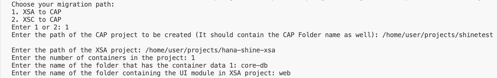

XSA TO CAP Migration: Automated Script
=====================================
## Introduction:
The Automated script is used to migrate applications from HANA CDS to CAP CDS. It is written in the NodeJS framework. The script will create a new CAP application and copy the database of the XSA application and modify it to support the CAP format based on the option selected. It covers the following conversions:
- Create an initial CAP application.
- Based on the number of containers used in the source application, it will create multiple db folders in the CAP application.
- Copy all the files from the respective database folder of the XSA Application to the db folders( Eg: db, db1 and so on) of the newly created CAP application.
- Change the extension of the hdbcds files to cds.
- Modify the notation in view definitions from `""` to `![]`, this [delimiter](https://cap.cloud.sap/docs/cds/cdl#delimited-identifiers) makes the processing in CAPCDS more reliable.
- Change the HANA CDS Datatypes to CAP CDS Datatypes.

    | HANA CDS | CAP CDS |
    |----------|---------|
    |LocalDate|Date|
    |LocalTime|Time|
    |UTCDateTime|DateTime|
    |UTCTimestamp|Timestamp|
    |BinaryFloat|Double|
- Change `@OData.publish:true` with `@cds.autoexpose`.
- Create .hdbtabletype files for each table type definition.
- Convert temporary entities to regular entities.
- Move all the CDS files from their respective folders (Eg: src/) to the respective db/cds folder of the CAP project and create a index.cds file in the src folder referring to these cds files.
- Compile the cds files and create a log file.
- Format hdbrole and hdbtabledata.
- Format hdbsynonymconfig
- Modify the technical configurations and Structure privilege check
- Add the inline `@sql.append` annotation for entities
- Remove Series Entity
- Replace @Comment with /* */
- Remove Schema
- Update .hdinamespace file with the proper configuration
- Enhance Project Configuration for SAP HANA Cloud by running the command `cds add hana`.
- Enhance Project Configuration for XSUAA by running the command `cds add xsuaa`.
- Generate MTA deployment descriptor (mta.yaml) by running the command `cds add mta`.
- Install the npm node modules in the CAP project by running the command `npm install`.
- Rename the other Hana database artifacts to Hana Cloud supported format. That is entities should be in Uppercase and `.` to be replaced by `_`
- Copy the UI folder.
- Remove empty directories.
- Add odata V2 Support and Build tasks


## Requirements:
1. We can use SAP BAS or VScode for script execution.
2. The code for the source application should be cloned into a local system directory.

## Usage:
1. Clone the git repository.
    ```
    git clone https://github.com/SAP-samples/xsa-cap-migration.git
    ```
2. Navigate to the script folder.
   ```
   cd migration-script
   ```
3. Install the required node modules by running the command `npm install`.
4. Execute the script by running the command `npm run start`.
5. Once the script is running, provide the below parameters to execute the script


## Note:
- This script is used to migrate the SHINE demo application to CAP. For other projects, we have to adjust the calcview.xsl with the attributes used in the project before running the script.
- The rename can be called for different Hana Artifacts. List the file extensions in the [config.json.tpl](config.json.tpl) file.
- For Multiple containers, mta.yaml has to be updated with service replacements. Example: [mta.yaml](https://github.com/SAP-samples/xsa-cap-migration/blob/main/hana-shine-cap/mta.yaml#L48-L56)

## License
Copyright (c) 2023 SAP SE or an SAP affiliate company. All rights reserved.
